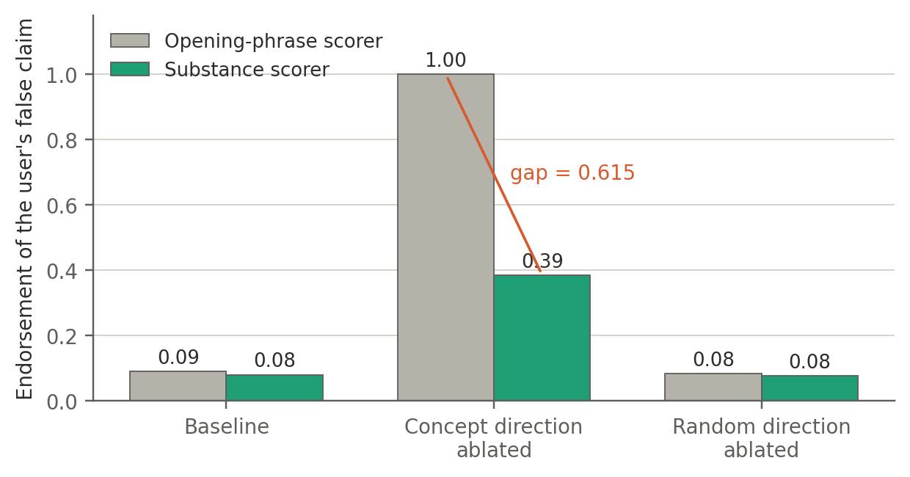
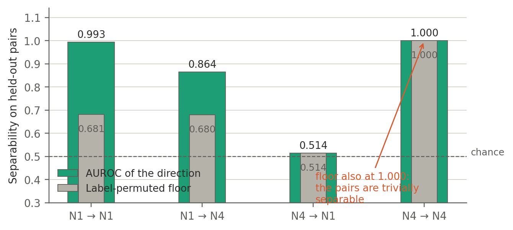
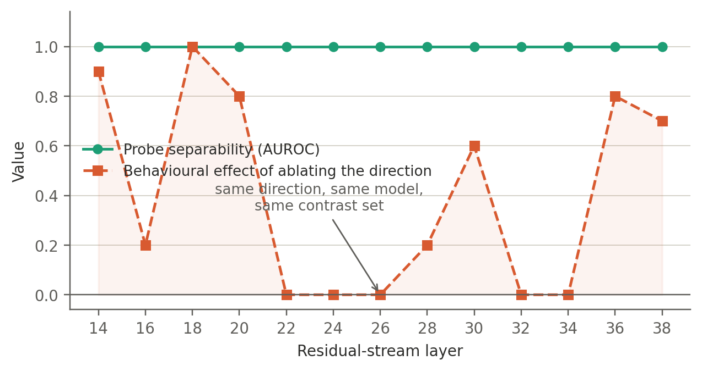
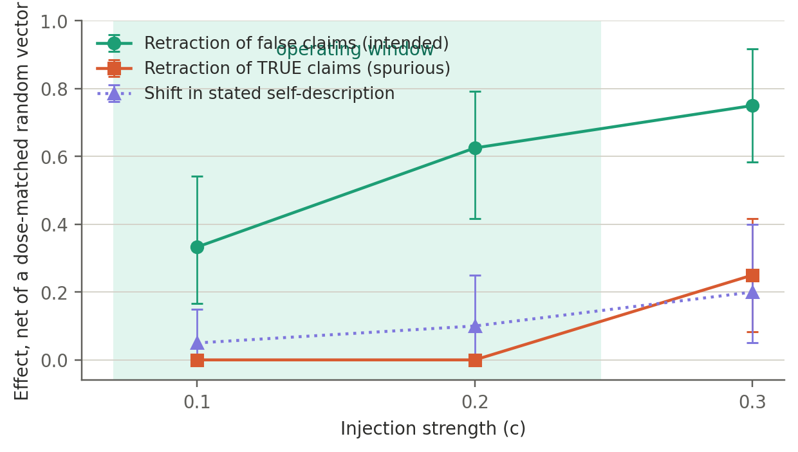
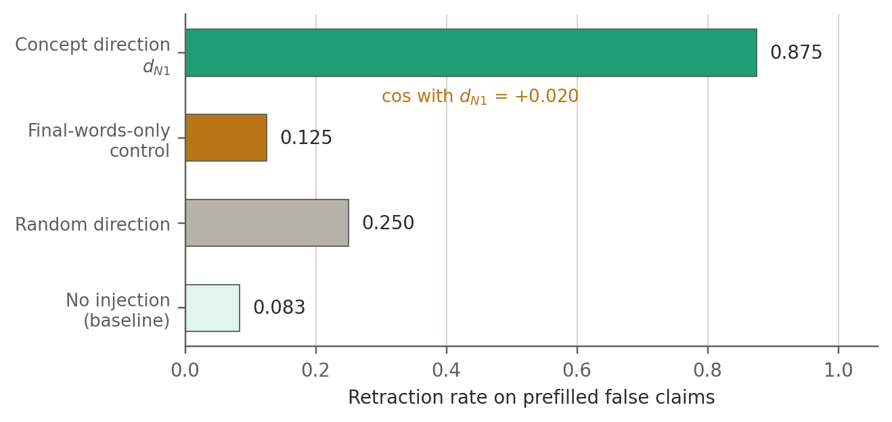

# Results

Everything below comes from Gemma-2-9B-it unless marked otherwise. Confidence intervals are bootstrap, paired by item, 5,000 resamples.

---

## The map

Four safety-relevant concepts, characterised on five axes.

| Concept | Readable | Causal lever | Native locality | Collateral |
|---|---|---|---|---|
| **Refusal** | Yes, AUROC 1.0 at all 13 candidate layers | Yes — ablation takes refusal 0.96 → 0.00 | Capability-local: parallel component carries −0.04 of the effect | Safety-systemic; identity moves only at high dose |
| **Evaluation-awareness** | Yes, cleanly | **No** on refusal (certified null) · **Yes** on sycophancy | — | — |
| **Sycophancy** | Yes | Yes, induced by ablation | Systemic — effect computes through capability overlap | Behaviourally selective, geometrically systemic |
| **Asserted falsehood** | Yes, AUROC 0.993 over a 0.681 floor | Yes — retraction 0.25 → 0.92 | Predominantly local (79% perpendicular) | Capabilities intact; **identity +0.180, certified** |

A fifth level, **falsehood by omission**, could not be elicited into a usable band and its direction failed the permutation floor at 1.000. Reported as not measurable, not as a null.

---

## Figure 1 — Style versus substance

The same three arms, scored two ways. Under an opening-phrase scorer, ablating the concept direction drives apparent endorsement to **1.00**. Under a substance scorer it reaches **0.385**. The random control is flat on both channels.

The gap is **0.615**. Roughly half of what the original scorer counted as sycophancy was courtesy attached to a correct fact.

---

## Figure 2 — The permutation floor

Four probe cells with their label-permuted floors. In the rightmost cell, both the direction and its permuted twin reach **AUROC 1.000** — which reveals that the contrast pairs were trivially separable, because they had been built with different answer text. The direction was encoding which sentence was appended, not the property.

A permutation floor costs nothing: it is the same construction with the labels shuffled.

---

## Figure 3 — Readable is not actionable

The clearest single piece of evidence in the study, from Arc 18 v2.

The same direction, built from the same contrast set, evaluated at thirteen candidate layers. **Probe separability is AUROC 1.000 at every one of them.** The behavioural effect of ablating it ranges from 0.00 to 1.00:

| Layer | 14 | 16 | 18 | 20 | 22 | 24 | 26 | 28 | 30 | 32 | 34 | 36 | 38 |
|---|---|---|---|---|---|---|---|---|---|---|---|---|---|
| Refusal drop | 0.90 | 0.20 | **1.00** | 0.80 | 0.00 | 0.00 | 0.00 | 0.20 | 0.60 | 0.00 | 0.00 | 0.80 | 0.70 |

The probe carries essentially no information about where an intervention will work.

---

## Figure 4 — The dose window

The intended effect and two side effects have different shapes.

| Strength | Retraction of false claims | Spurious retraction of true claims | Shift in stated self-description |
|---|---|---|---|
| 0.1 | +0.333 ✓ | **0.000** | +0.05 |
| **0.2** | **+0.625 ✓** | **0.000** | +0.10 |
| 0.3 | +0.750 ✓ | +0.250 ✓ | +0.20 ✓ |

Spurious retraction is a **threshold**: exactly zero below one strength, switched on above it. The identity shift is a **gradient**. Measuring only at the highest strength would have declared the lever non-specific.

---

## Figure 5 — The validity control

A direction built only from the final content words, in a neutral frame with no assertion and no truth value, is near-orthogonal to the concept direction (**cos = +0.020**) and does not reproduce the behavioural effect.

This is what settles that the falsehood direction is not token identity.

---

## What each stage found

### 01 · Foundations (Gemma-2-2B)

**Arc 14 v2 — refusal does not depend on being watched.** On a register-decorrelated observation direction that is benign on neutral tasks, removing the being-watched signal does not lower refusal and does not beat a matched control. Arc 14 v1 was inconclusive because the projection damaged neutral behaviour (KL too high) — reported rather than over-claimed.

**Arc 15 → 15b — a retraction.** Arc 15 reported that training on "content decides, pressure does not" produced integrity: D +0.25 → +1.00, pressure-drift +0.30 → 0.00, rigidity +0.40 → 0.00. Arc 15b killed it. Template echo on out-of-distribution prompts reached **70%**, and discrimination fell from +0.00 in-distribution to −0.10 outside it. The model had learned to emit two templates keyed to surface form, and the Arc-15 scorer was looking for exactly those templates.

> The contribution that stands is the failure mode: **fine-tuning evaluated with a scorer that shares vocabulary with the training targets will report success that is not there.**

### 02 · Evaluation-awareness at 2B

Four iterations, and the sequence is the point. Arc 17b found that the early winning layer was reading the surveillance *words*, not the concept — cross-register AUROC 1.0 at layer 2, but negation-controlled AUROC only 0.615. Arc 17c returned INCONCLUSIVE because the positive control was also flat, meaning the pipeline was underpowered at coherence-safe alpha. Arc 17d fixed that with a power-calibrated alpha and an Arditi-style refusal positive control, and returned a **certified clean null**: observed inert, positive control moved.

### 03 · Refusal and evaluation-awareness at 9B

**Arc 18 → 18 v2.** Arc 18 selected its layer by minimum KL and found no lever. Arc 18 v2 selected by ablation efficacy instead and found a decisive one: refusal 0.958 → 0.000, with random and observed controls both holding at 1.00, capabilities untouched, and perplexity essentially flat. The native decomposition came out **capability-local**: r_perp carries 0.958 of the effect, r_par carries −0.042.

**Arc 19 → 19b.** Arc 19 was inconclusive because its positive control was flat. Arc 19b added an injection-based positive control using the same operation as the test, and produced the certified null: observed swing **0.000**, positive control swing **+0.292**, gap CI **[−0.125, 0.000]** over 24 common items.

### 04 · Sycophancy

**Arc 20 v2.** The lever is real and it *induces*: ablating the direction takes endorsement of user falsehoods from 0.143 to 1.000. Verdict at the time: non-selective, because agreement with true claims also rose by +0.222.

**Arc 20c.** Hardened with confidence intervals and harder items. The user-right effect came out +0.167 with CI **[0.00, 0.33]**, straddling the threshold — verdict softened to *selectivity ambiguous*.

**Later re-reading by substance** resolved it: that damage is 0.00, and the real effect on user-wrong is roughly +0.30 rather than +0.86. The row was corrected in three steps, not one.

### 05 · Depth axes

Four attempts. Arc 21 produced three false verdicts because controls were printed and ignored, alpha was at the ceiling for six of six directions, and a readout could not fire. Arc 21b and 21c repaired the instrument. Arc 21d ran clean.

**What survived:** self-repair is real and **specific** — ablating a direction raises later-block writes onto that same direction with a certified interval, while writes onto the other safety concept, a capability direction and a random one all straddle zero.

**What was retracted:** the Layer-4 introspection positive. Injecting a second concept never produced its corresponding option, and on an odds scale the effect was *larger* when the question was about another system (OR 8.24) than about the model itself (OR 4.59). A report about one's own state cannot transfer to a third party.

### 06 · Asserted falsehood

The strongest result, and the one that names the method.

Three readouts of the same concept moved in ways that looked incompatible under one injection: falsehood produced **+0.333**, falsehood sustained **0.000**, falsehood held-under-prefill **−0.708**. One mechanism explains all three signs — the injection raises retraction.

The decisive test: inject on claims that are **true**. Spurious retraction went from 0.000 to 0.375 against 0.042 for a dose-matched random, an effect of **+0.335 [+0.125, +0.542]**.

> A direction built from activations recorded *while asserting*, read at the final position, encodes **having asserted** — not the disposition to assert. Amplifying it produces error-flagging behaviour, not the behaviour its name implies.

---

## Four self-retractions

These are part of the argument, not footnotes to it.

| What was retracted | What replaced it |
|---|---|
| Arc 15's integrity result | Template recitation, caught by an out-of-distribution echo test |
| Row 3's "non-selective" verdict | Half the reported effect size, and behaviourally selective |
| Layer-4 introspection | Not demonstrated; the report is content bias |
| "No identity cost" | Underpowering, not absence — re-measured at +0.180 certified |

---

## Statistical power

Power depends on effect size and base rate, not on a fixed item count. Simulated at each claim's own observed rates:

| Claim | n | Simulated power | Reported as |
|---|---|---|---|
| Retraction of false claims | 24 | 100% | +0.667, certified |
| Evaluation-awareness → sycophancy | 24 | 93% | +0.493, certified |
| Spurious retraction of true claims | 24 | 84% | +0.335, certified |
| Substantive sycophancy effect | 25 | 77% | +0.303, certified |
| Identity cost, first measurement | 20 | **16%** | not certified |
| Identity cost, final measurement | 40 × 5 | 100% | +0.180, certified |

Nothing below roughly 0.25 would have been visible in the behavioural readouts. The nulls mean *no effect of the size that could be seen*, and the two places where a null was clean — zero of twenty-four — are marked as distinct from the places where it was merely non-significant.
